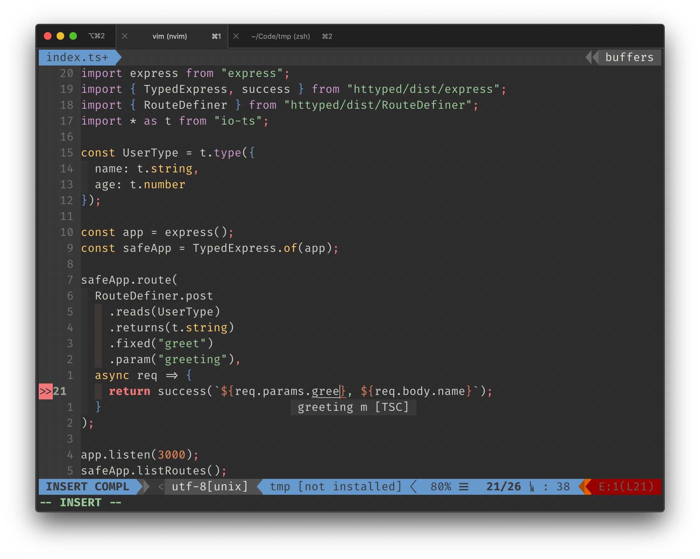
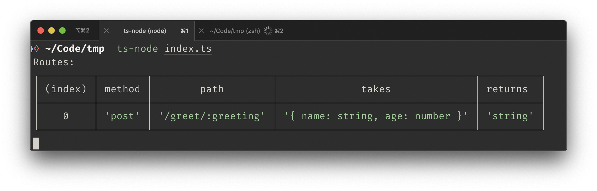
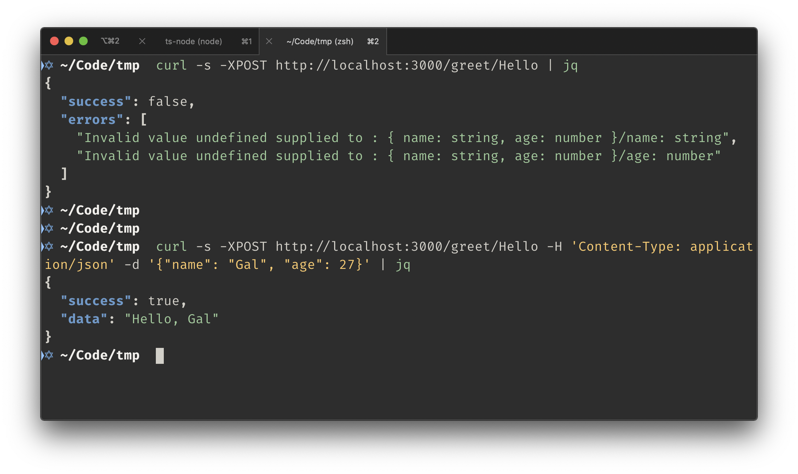

# `httype`

> ⛓️ Type-safe HTTP client/server communications with awesome autocompletion

Let your compiler tell you when you break a contract with your client.

## Features

✅ Awesome autocompletion and type safety for request parts



✅ Nice and simple route documentation



✅ Compile time and runtime type validation



# Usage

## Route

A route is defined by `RouteDefiner`. This part is shared for both server and client.

:white_check_mark: Supports dynamic parameters

:white_check_mark: Supports a typed request body with [io-ts](https://github.com/gcanti/io-ts)

:white_check_mark: Supports a typed response type with [io-ts](https://github.com/gcanti/io-ts)

#### Examples:

- A `GET` route that returns a `string` output, with a fixed path of `/hello`:

  ```ts
  RouteDefiner.get.returns(t.string).fixed("hello");
  ```

- A route that returns a `string` output, with a dynamic path of `/hello/:name`:

  ```ts
  RouteDefiner.get
    .returns(t.string)
    .fixed("hello")
    .param("name");
  ```

- A `POST` route that reads a custom type `User` from the request body and returns a custom type `Greeting`:

  ```ts
  const Greeting = t.type({ msg: t.string });
  const User = t.type({ name: t.string });

  RouteDefiner.post
    .reads(User)
    .returns(Greeting)
    .fixed("user-to-greeting");
  ```

## Server

Implementation for servers is by wrapping Express.js

:white_check_mark: Type safe body parsing, thanks to [io-ts](https://github.com/gcanti/io-ts)

:white_check_mark: Awesome autocompletion for routing params and request body

:white_check_mark: Pretty routing table, documentation ready

```ts
import { TypedExpress, success } from "httyped/express";
import express from "express";

const app = express();
const typed = TypedExpress.of(app);

typed.route(
  RouteDefiner.get // a get request
    .returns(t.string) // that returns a string
    .fixed("hello") // and its path is
    .param("name"), // `/hello/:name`
  async req => {
    return success(`Hello, ${req.params.name}`);
  }
);

app.listen(3000);
typed.listRoutes(); // Will print a table of routes
```

## Client

A http client based on `node-fetch`:

:white_check_mark: Type-safety between client and server

:white_check_mark: Autocompletion for request parameters and request body

```ts
import { fetcher } from "httyped/fetch";

const User = t.type({ name: string }, "User");

// given a route
const route = RouteDefiner.post
  .reads(User)
  .returns(t.string)
  .fixed("hello")
  .param("greeting");

const fetch = fetcher(route, "http://localhost:3000");
//                           ^ the base URI

const { status, data } = await fetch({
  params: {
    greeting: "Hello"
  },
  body: {
    name: "Gal"
  }
});
```
